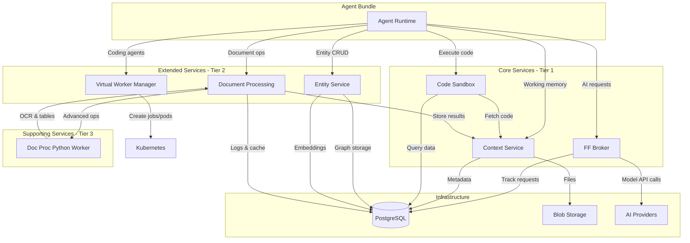
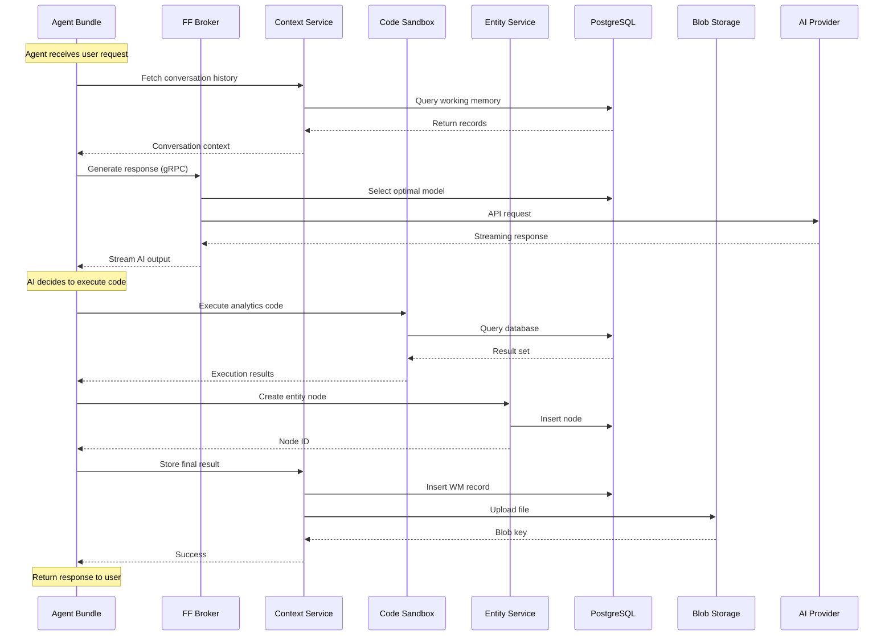
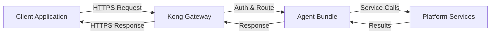
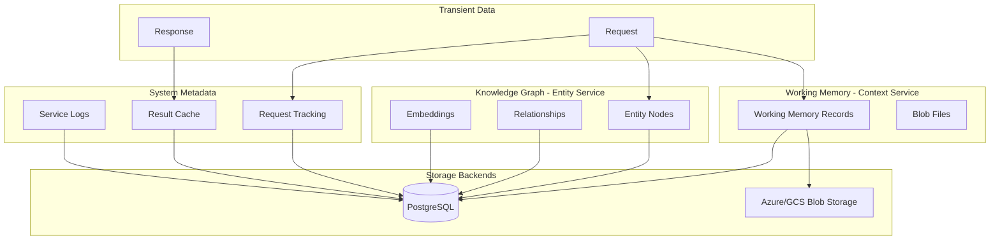

# FireFoundry Platform Services

## Overview

FireFoundry platform services are specialized microservices that provide the runtime infrastructure for AI agent bundles. These services handle AI model orchestration, persistent state management, secure code execution, document processing, entity graph storage, and other foundational capabilities that agents need to operate effectively.

Each service is designed as an independently deployable, scalable microservice with well-defined APIs (gRPC or REST), comprehensive observability, and production-grade reliability. Services communicate through standardized protocols and share common infrastructure including PostgreSQL databases, blob storage backends, and Kubernetes networking.

## Service Categories

### Tier 1: Core Runtime Services (GA - Production Ready)

The Core Runtime Services form the essential foundation of the FireFoundry platform. These services have reached General Availability status and are production-ready, battle-tested, and API-stable. Every agent bundle deployment depends on these services for basic operations.

**Core Services:**
- **FF Broker** - AI model routing with automatic provider selection and failover
- **Context Service** - Working memory, blob storage, and conversation persistence
- **Code Sandbox** - Secure execution environment for TypeScript code with database access

### Tier 2: Extended Services (Beta)

Extended Services provide specialized capabilities that enhance agent functionality beyond the core runtime. These services are in active development with stable APIs but may undergo minor changes as features are refined based on production usage.

**Extended Services:**
- **Entity Service** - Entity graph management with vector-based semantic search
- **Data Access Service** - Secure multi-database SQL access with AST query translation and fine-grained ACL
- **Document Processing Service** - Document extraction, generation, and transformation
- **Virtual Worker Manager** - CLI coding agent orchestration with managed sessions and persistent workspaces

### Tier 3: Supporting Services

Supporting Services include services under active development that extend platform capabilities. These are functional but may undergo API changes as features are refined.

**Supporting Services:**
- **Notification Service** - Cloud-agnostic email and SMS delivery with pluggable provider adapters (Beta)
- **Document Processing Python Worker** - Advanced ML-based document processing (Planning)
- **Web Search Service** - Provider-agnostic web search with Bing integration (Beta)

## Service Overview Matrix

| Service | Version | Status | Purpose | Tier | Protocol |
|---------|---------|--------|---------|------|----------|
| **FF Broker** | 5.2.7 | GA | AI model routing and orchestration across multiple providers | Core | gRPC |
| **Context Service** | 2.0.0 | GA | Working memory, blob storage, and conversation persistence | Core | gRPC |
| **Code Sandbox** | 2.0.0 | GA | Secure code execution with database connectivity | Core | REST |
| **Entity Service** | 0.3.0-beta.0 | Beta | Entity graph management with vector semantic search | Extended | REST |
| **Data Access Service** | 0.1.0 | Beta | Multi-database SQL access with AST query translation and ACL | Extended | gRPC + REST |
| **Document Processing** | 0.1.10 | Beta | Document extraction, OCR, generation, transformation | Extended | REST |
| **Notification Service** | 0.1.1 | Beta | Cloud-agnostic email and SMS delivery with pluggable providers | Supporting | REST |
| **Doc Proc Python Worker** | 0.1.0 | Planning | Advanced ML-based document processing backends | Supporting | gRPC |
| **Web Search Service** | 0.1.0 | Beta | Provider-agnostic web search with Bing integration | Supporting | REST |
| **Virtual Worker Manager** | 0.1.0 | Beta | CLI coding agent orchestration with managed sessions and persistent workspaces | Extended | REST |

## How Services Work Together

### Architecture Overview

FireFoundry services follow a **microservices architecture** where each service has a single, well-defined responsibility and communicates with other services through standardized APIs. Agent bundles act as orchestrators, calling multiple services as needed to fulfill their objectives.

**Key Architectural Principles:**

1. **Stateless Services**: Services don't maintain session state between requests, enabling horizontal scaling
2. **Shared Storage**: Services share PostgreSQL databases and blob storage for persistence
3. **Service Discovery**: Kubernetes DNS provides automatic service discovery within the cluster
4. **API-First Design**: All services expose well-documented APIs (gRPC for performance, REST for simplicity)
5. **Independent Deployment**: Services can be updated and scaled independently
6. **Fail-Safe Patterns**: Services implement retry logic, circuit breakers, and graceful degradation

### Service Communication Patterns

**Internal Communication (Service-to-Service):**
- **gRPC**: High-performance binary protocol for low-latency internal communication (FF Broker, Context Service, Doc Proc Python Worker)
- **REST**: Simpler HTTP/JSON for services where performance is less critical (Entity Service, Document Processing, Code Sandbox)
- **Service Mesh**: Kubernetes DNS-based service discovery with `service-name.namespace.svc.cluster.local` addressing

**External Communication (Agent-to-Service):**
- Agent bundles connect to services using generated client libraries
- All communication secured with API keys or mutual TLS
- Services expose health endpoints for Kubernetes probes (`/health`, `/ready`)

**Data Persistence:**
- Services write to dedicated PostgreSQL schemas for isolation
- Blob data stored in Azure Blob Storage or Google Cloud Storage
- Context Service acts as the primary blob storage gateway

### Service Dependencies



**Dependency Relationships:**

- **Agent Bundles** depend on Core Services (Broker, Context, Sandbox)
- **Code Sandbox** may fetch code from Context Service
- **Document Processing** delegates advanced operations to Python Worker
- **All services** depend on PostgreSQL for metadata and state
- **Context Service** and **Document Processing** depend on blob storage
- **FF Broker** depends on external AI provider APIs
- **Entity Service** is self-contained with only PostgreSQL dependency
- **Virtual Worker Manager** depends on Kubernetes (for jobs/pods) and blob storage (for skills)

## Common Data Flows

### Agent Bundle Execution Flow

This flow shows how a typical agent bundle execution progresses through the platform services:



**Step-by-Step Explanation:**

1. **Context Retrieval**: Agent fetches conversation history from Context Service
2. **AI Generation**: Agent requests text generation from FF Broker, which routes to optimal AI provider
3. **Code Execution**: If AI decides code execution is needed, agent invokes Code Sandbox
4. **Entity Storage**: Results stored in Entity Service for graph relationships
5. **Result Persistence**: Final output saved to Context Service (metadata + blob)

### Request Processing Pipeline

How a client request flows through the platform from entry to response:



**Pipeline Stages:**

1. **API Gateway**: Kong validates authentication, applies rate limits, routes to agent bundle
2. **Agent Bundle**: Orchestrates calls to multiple platform services based on agent logic
3. **Service Layer**: Each service processes its specific operation independently
4. **Response Aggregation**: Agent bundle collects results and formats final response
5. **Gateway Response**: Kong returns response to client with appropriate headers

### Persistence and Storage Flow

How data is persisted across the platform for durability and retrieval:



**Storage Layers:**

- **Working Memory**: Conversation state, uploaded files, agent artifacts (Context Service → PostgreSQL + Blob Storage)
- **Knowledge Graph**: Structured entities and relationships with semantic embeddings (Entity Service → PostgreSQL with pgvector)
- **System Metadata**: Request tracking, performance logs, cached results (FF Broker, Document Processing → PostgreSQL)
- **Execution State**: Code execution history, analysis results (Code Sandbox → PostgreSQL via working memory)

## Service Communication Matrix

| Service A | Communicates With | Protocol | Purpose |
|-----------|-------------------|----------|---------|
| **Agent Bundle** | FF Broker | gRPC | Request AI completions and embeddings |
| **Agent Bundle** | Context Service | gRPC | CRUD working memory, upload/download blobs |
| **Agent Bundle** | Code Sandbox | REST | Execute TypeScript code with database access |
| **Agent Bundle** | Entity Service | REST | Create/query entity graph nodes and edges |
| **Agent Bundle** | Document Processing | REST | Extract text, generate PDFs, transform documents |
| **FF Broker** | PostgreSQL | SQL | Track requests, manage model configurations |
| **FF Broker** | AI Providers (Azure/OpenAI/Anthropic) | REST | Execute model inference requests |
| **Context Service** | PostgreSQL | SQL | Store working memory metadata |
| **Context Service** | Azure Blob/GCS | Cloud SDK | Upload/download file blobs |
| **Code Sandbox** | PostgreSQL | ODBC | Execute user queries via database adapters |
| **Code Sandbox** | Context Service | gRPC | Fetch code from working memory (optional) |
| **Entity Service** | PostgreSQL | SQL | Persist entity graph with pgvector embeddings |
| **Document Processing** | PostgreSQL | SQL | Cache results, log requests |
| **Document Processing** | Context Service | gRPC | Store/retrieve document data (planned) |
| **Document Processing** | Doc Proc Python Worker | gRPC | Delegate advanced OCR and table extraction |
| **Agent Bundle** | Virtual Worker Manager | REST | Create sessions, execute prompts, manage files |
| **Doc Proc Python Worker** | (None) | N/A | Stateless processing, no external dependencies |

## Configuration and Deployment Overview

### Shared Configuration

All FireFoundry services share common configuration patterns:

**Environment Variables (Common):**
```bash
# Service identification
NODE_ENV=production                    # Environment: development | production | test
SERVICE_NAME=service-name              # Service identifier
LOG_LEVEL=info                         # Logging level: debug | info | warn | error

# Observability
APPLICATIONINSIGHTS_CONNECTION_STRING=...  # Azure Application Insights
```

**Health Endpoints (Standard):**
- `GET /health` - Liveness probe (always returns 200)
- `GET /ready` - Readiness probe (checks dependencies)
- `GET /status` - Service status and uptime

**Docker Configuration:**
- Multi-stage builds for optimized image sizes
- Non-root user execution for security
- Graceful shutdown on SIGTERM/SIGINT
- Health check commands for Docker

### Service Dependencies

**PostgreSQL (Required by Most Services):**
```bash
PG_SERVER=your-server.postgres.database.azure.com
PG_DATABASE=firefoundry_beta
PG_PORT=6432                           # 5432 direct, 6432 for pgbouncer
PG_PASSWORD=readonly-password
PG_INSERT_PASSWORD=write-password      # Separate user for writes
```

**Blob Storage (Context Service, Document Processing):**

*Option 1: Azure Blob Storage*
```bash
WORKING_MEMORY_STORAGE_ACCOUNT=yourstorageaccount
WORKING_MEMORY_STORAGE_KEY=your-access-key
WORKING_MEMORY_STORAGE_CONTAINER=your-container
```

*Option 2: Google Cloud Storage*
```bash
GOOGLE_CLOUD_PROJECT=your-project-id
GOOGLE_APPLICATION_CREDENTIALS_JSON='{"type":"service_account",...}'
WORKING_MEMORY_STORAGE_CONTAINER=your-bucket-name
```

**AI Provider APIs (FF Broker):**
```bash
# At least one provider required
AZURE_OPENAI_API_KEY=...
OPENAI_API_KEY=...
ANTHROPIC_API_KEY=...
GOOGLE_CLOUD_PROJECT=...
```

### Network and Service Discovery

**Kubernetes DNS-Based Discovery:**

Services communicate using Kubernetes service names that resolve to cluster IPs:

```
{service-name}.{namespace}.svc.cluster.local:{port}
```

**Example Service Addresses:**
- FF Broker: `firefoundry-ff-broker.ff-dev.svc.cluster.local:50061`
- Context Service: `firefoundry-context-service.ff-dev.svc.cluster.local:50051`
- Code Sandbox: `firefoundry-code-sandbox.ff-dev.svc.cluster.local:3000`
- Entity Service: `firefoundry-entity-service.ff-dev.svc.cluster.local:8080`
- Document Processing: `firefoundry-doc-proc.ff-dev.svc.cluster.local:8080`

**Network Policies:**
- Services in the same namespace can communicate freely
- Cross-namespace communication requires explicit NetworkPolicy rules
- External egress controlled by Kubernetes NetworkPolicy

## Getting Started with Services

### Local Development

**Running Core Services Locally:**

1. **Prerequisites:**
   - Docker and Docker Compose
   - Node.js 20+, Python 3.11+ (for local service development)
   - PostgreSQL (local or cloud instance)
   - Cloud storage credentials (Azure or GCP)

2. **Start Individual Services:**
   ```bash
   # Clone service repository
   git clone https://github.com/firebrandanalytics/{service-repo}
   cd {service-repo}
   
   # Install dependencies
   pnpm install  # or pip install -r requirements.txt for Python
   
   # Configure environment
   cp .env.example .env
   # Edit .env with your credentials
   
   # Start service
   pnpm dev      # Node.js services
   python src/main.py  # Python services
   ```

3. **Using Docker Compose:**
   ```bash
   # See self-contained deployment guide
   cd ff-public-docs/docs/firefoundry/platform/self-contained
   docker-compose up -d
   ```

**Local Development Best Practices:**
- Use local PostgreSQL with Docker for faster iteration
- Use MinIO for local blob storage (S3-compatible)
- Point services to local dependencies via environment variables
- Use `NODE_ENV=development` to enable verbose logging

### Production Deployment

**Key Considerations for Production:**

1. **Infrastructure Requirements:**
   - Kubernetes cluster (AKS, GKE, EKS)
   - PostgreSQL with high availability (Azure Database for PostgreSQL, Cloud SQL)
   - Blob storage with replication (Azure Blob Storage, GCS)
   - Container registry (Azure ACR, Google GCR)

2. **Security Configuration:**
   - Store secrets in Kubernetes Secrets or Azure KeyVault
   - Use managed identities for cloud service authentication
   - Enable TLS for all service-to-service communication
   - Implement NetworkPolicies to restrict traffic

3. **Scalability:**
   - Configure horizontal pod autoscaling (HPA) based on CPU/memory
   - Use separate connection pools for read and write operations
   - Enable caching where appropriate (Entity Service, Document Processing)
   - Monitor service metrics and adjust resource requests/limits

4. **Observability:**
   - Send logs to centralized logging (Azure Application Insights, Cloud Logging)
   - Configure distributed tracing with correlation IDs
   - Set up alerts for service health and performance degradation
   - Monitor PostgreSQL connection pool utilization

5. **Deployment Strategy:**
   - Use blue-green or rolling deployments for zero downtime
   - Test services in staging environment before production
   - Version services semantically (MAJOR.MINOR.PATCH)
   - Maintain API compatibility during upgrades

**Resource Recommendations (Per Service):**
```yaml
resources:
  requests:
    cpu: 500m
    memory: 512Mi
  limits:
    cpu: 2000m
    memory: 2Gi
```

## Individual Service Documentation

Detailed documentation for each service:

### Tier 1: Core Runtime Services
- [FF Broker](./ff-broker/README.md) - AI model routing and orchestration with industrial-scale subsystems
- [Context Service](./context-service.md) - Working memory and blob storage
- [Code Sandbox](./code-sandbox.md) - Secure code execution environment

### Tier 2: Extended Services
- [Data Access Service](./data-access/README.md) - Multi-database SQL access with AST queries, staged federation, and scratch pad
- [Entity Service](./entity-service.md) - Entity graph with vector search
- [Document Processing Service](./doc-proc-service.md) - Document operations
- [Virtual Worker Manager](./virtual-workers/README.md) - CLI coding agent orchestration with managed sessions

### Tier 3: Supporting Services
- [Document Processing Python Worker](./doc-proc-pyworker.md) - ML-based processing
- [Web Search Service](./web-search.md) - Provider-agnostic web search with Bing

## Monitoring and Observability

### Service Health Monitoring

**Health Check Endpoints:**
- `/health` - Liveness probe (service is running)
- `/ready` - Readiness probe (service and dependencies are ready)
- `/status` - Detailed status including uptime and version

**Kubernetes Integration:**
```yaml
livenessProbe:
  httpGet:
    path: /health
    port: 8080
  initialDelaySeconds: 30
  periodSeconds: 10

readinessProbe:
  httpGet:
    path: /ready
    port: 8080
  initialDelaySeconds: 5
  periodSeconds: 5
```

### Logging and Tracing

**Structured Logging:**
- All services use structured JSON logging (winston for Node.js, structlog for Python)
- Correlation IDs propagate through service calls for request tracing
- Log levels: DEBUG, INFO, WARN, ERROR

**Application Insights Integration:**
- Automatic telemetry collection for Node.js services
- Custom events and metrics tracked per service
- Distributed tracing across service boundaries

**Key Metrics to Monitor:**
- Request rate and latency (p50, p95, p99)
- Error rate and types
- Database connection pool utilization
- Cache hit rates (Entity Service, Document Processing)
- Blob storage operation latency
- AI provider response times (FF Broker)
- Code execution time and success rate (Code Sandbox)

### Alerting Guidelines

**Critical Alerts:**
- Service health check failures
- Database connection failures
- Blob storage unavailability
- AI provider API failures
- High error rates (>5% of requests)

**Warning Alerts:**
- Increased latency (>2x baseline)
- High memory or CPU usage (>80%)
- Connection pool saturation
- Cache miss rate increase

## Security Considerations

### Authentication and Authorization

**API Key Authentication:**
- Most services require `x-api-key` header for authentication
- API keys stored in Kubernetes Secrets
- Rotate keys regularly using automated processes

**Service-to-Service Authentication:**
- Mutual TLS (mTLS) for production deployments
- Service mesh (Istio, Linkerd) for automatic mTLS
- Network policies restrict traffic to authorized services

### Secrets Management

**Best Practices:**
- Never commit secrets to repositories
- Use Azure KeyVault or Google Secret Manager for production
- Use Kubernetes Secrets with RBAC for cluster secrets
- Rotate credentials regularly
- AI-generated code NEVER receives secrets directly (Code Sandbox principle)

**Secret Injection:**
- Environment variables from Kubernetes Secrets
- Volume mounts for certificate files
- Managed identities for cloud resources (preferred)

### Network Security

**Isolation:**
- Services deployed in dedicated namespaces
- NetworkPolicies restrict ingress/egress
- Public-facing services behind Kong Gateway
- Internal services not exposed externally

**Data in Transit:**
- TLS 1.2+ for all external communication
- mTLS for service-to-service within cluster
- VPN or private endpoints for database connections

**Data at Rest:**
- Database encryption at rest (PostgreSQL TDE)
- Blob storage encryption (Azure Storage Service Encryption, GCS default encryption)
- Encrypted Kubernetes Secrets (KMS integration)

## Troubleshooting

### Common Issues and Solutions

**Service Won't Start:**
- **Check logs**: `kubectl logs <pod-name> -n <namespace>`
- **Verify configuration**: Ensure all required environment variables are set
- **Database connectivity**: Test connection to PostgreSQL with `psql`
- **Blob storage**: Verify credentials and container/bucket exists

**High Latency:**
- **Check database**: Monitor PostgreSQL slow query logs
- **Connection pooling**: Verify pool settings are appropriate for load
- **Cache configuration**: Enable caching in Entity Service and Document Processing
- **Network issues**: Check Kubernetes network policies and service mesh config

**Memory Issues:**
- **Increase limits**: Adjust Kubernetes resource limits
- **Connection leaks**: Monitor database connection pool for leaks
- **Blob streaming**: Ensure large files are streamed, not loaded into memory
- **Code Sandbox**: Review user code for memory-intensive operations

**Authentication Failures:**
- **API keys**: Verify keys are correctly configured in Kubernetes Secrets
- **Expired credentials**: Check AI provider API keys and cloud credentials
- **Network policies**: Ensure services can reach authentication endpoints

### Service-Specific Debugging

**FF Broker:**
- Check `brk_tracking` schema for request logs
- Verify model group configurations in database
- Test provider API connectivity directly
- Review failover policy settings

**Context Service:**
- Verify blob storage credentials and connectivity
- Check PostgreSQL for working memory records
- Test MCP server functionality directly
- Review blob upload/download logs

**Code Sandbox:**
- Check compilation errors in response
- Verify database connection strings
- Review harness logs for database adapter issues
- Test code locally before deploying

**Entity Service:**
- Check pgvector extension is installed
- Verify batch insert metrics if using batching
- Review cache statistics for performance
- Test vector search with known embeddings

**Document Processing:**
- Check Azure Document Intelligence quota
- Verify cache hit rates in metrics
- Review Python worker connectivity (if using)
- Test file uploads with curl

### Where to Look for Issues

**Service Logs:**
```bash
kubectl logs <pod-name> -n ff-dev --tail=100 -f
```

**Database Queries:**
```sql
-- Check recent requests (FF Broker)
SELECT * FROM brk_tracking.completion_request ORDER BY created DESC LIMIT 10;

-- Check working memory (Context Service)
SELECT * FROM working_memory ORDER BY created DESC LIMIT 10;

-- Check entity nodes (Entity Service)
SELECT * FROM entity.node ORDER BY created DESC LIMIT 10;
```

**Service Metrics:**
```bash
# Cache stats (Entity Service)
curl http://entity-service:8080/api/cache/stats

# Batch metrics (Entity Service)
curl http://entity-service:8080/api/batch/metrics

# Health check (any service)
curl http://service:port/health
```

**Application Insights:**
- Navigate to Azure Portal → Application Insights
- Use Kusto queries to filter by service name and correlation ID
- Review dependency tracking for external API calls

## Related Platform Documentation

- [Platform Overview](../README.md) - High-level platform architecture
- [Platform Architecture](../architecture.md) - Detailed architectural decisions
- [Deployment Guide](../deployment.md) - Production deployment procedures
- [Operations Guide](../operations.md) - Day-to-day operations and maintenance
- [Self-Contained Setup](../self-contained/README.md) - Local development with Docker Compose
- [Agent SDK Documentation](../../sdk/README.md) - Building agents that use these services
